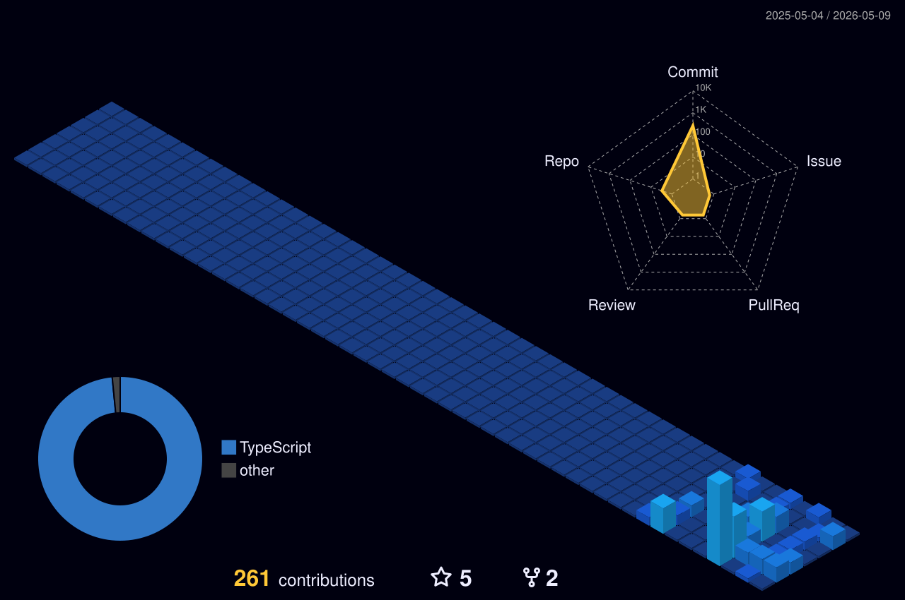

&nbsp;

---

### 🛠️ Tech Stack

**Languages & Frameworks**

**Tools & Infra**

---

### 📊 Stats

  

  

---

### 🎮 FGC Tools

### 🤖 AI / Agents

> **Maps Agency** *(private — shipping soon)*
> Autonomous agent pipeline that finds local businesses with sleepy websites and pitches them custom mockups.

### 🗄️ Infra & Tools

> **Oracle Cloud Database Mapper** *(private)*
> Interactive ERD tool that maps Oracle Cloud ERP database schemas with scroll-driven node/edge animations.

### 🌐 Web

